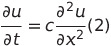
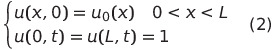
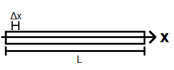
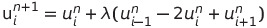
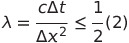
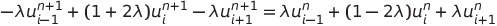
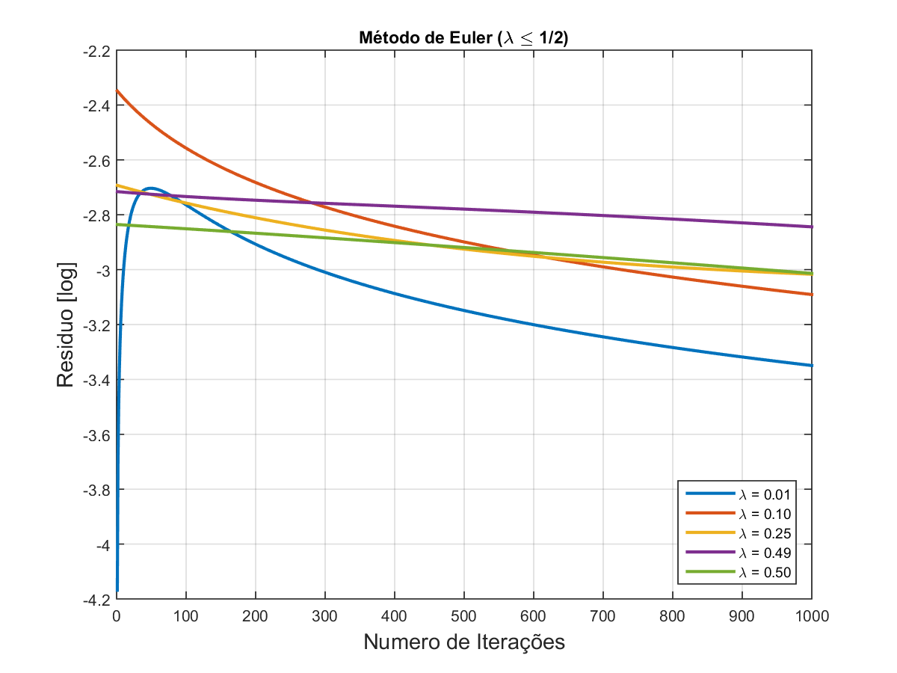
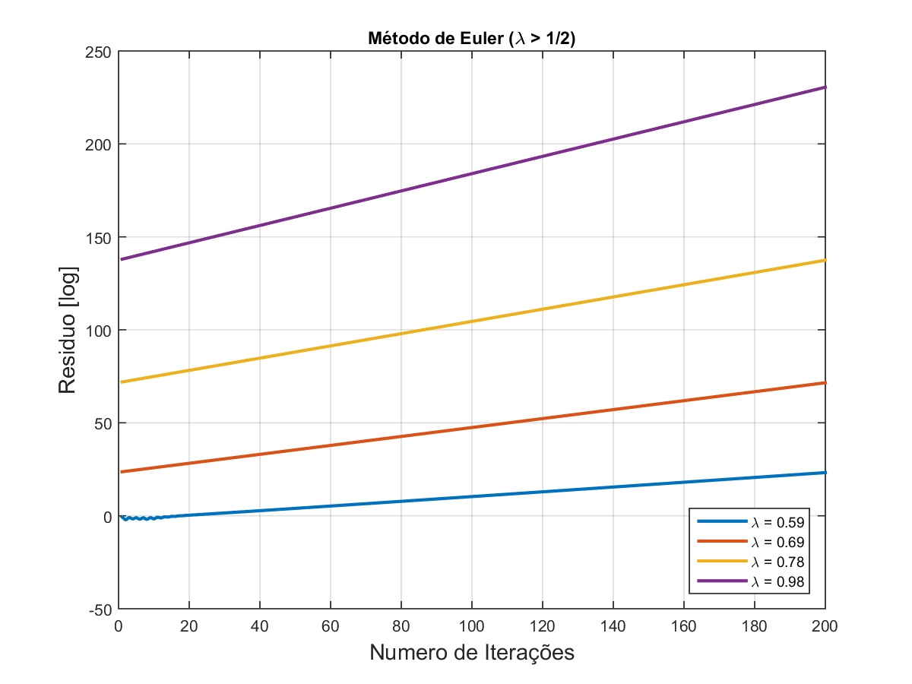
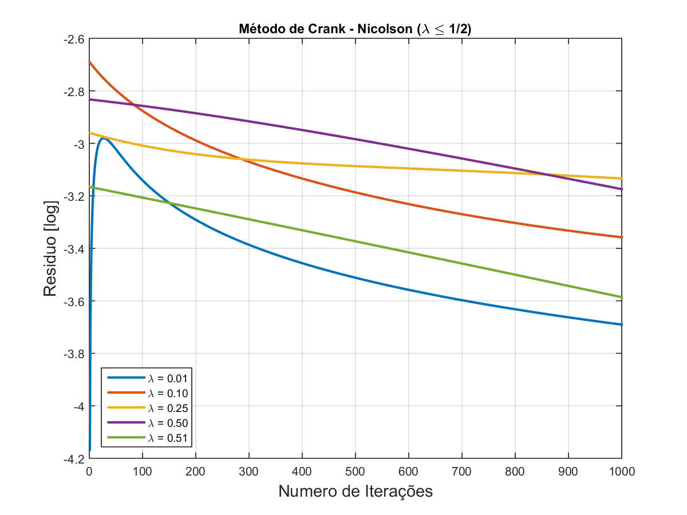
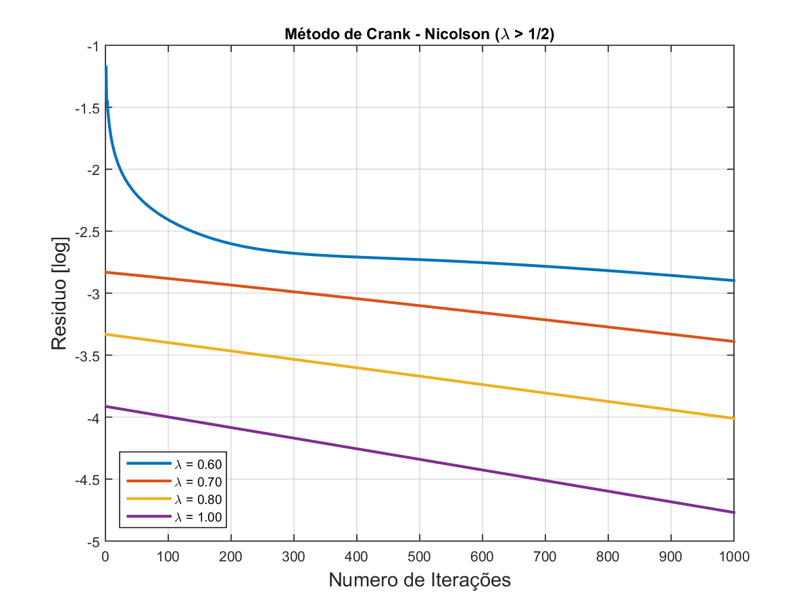

# Crank-Nicolson
## Analise de estabilidade dos métodos explicito de Euler e implícito de Crank-Nicolson para a equação de calor.
### Resumo
*Verificação dos critérios de estabilidade da solução numérica para equação de calor unidimensional em um domínio unitário usando os métodos de Euler e Crank-Nicolson. Através do método das diferenças finitas será discretizado e derivado o método de Euler explícito e implícito. O primeiro será utilizado especificamente para verificar a estabilidade condicional da técnica, porém ambos serão combinados para derivar o método de Crank-Nicolson, frequentemente aplicado a problemas de difusão,  verificamos se a técnica é incondicionalmente estável ou não. Também foi avaliado os efeitos da variação do parâmetro **\Delta t**, ou seja o intervalo do tempo de integração, em relação ao número de Courant-Friedrichs-Lewy (**\lambda**) e identificamos uma relação de proporcionalidade entre eles. Durante as simulações foram obtidos os valores dos erros residuais de aproximação em cada passo de iteração para diferentes valores de **\Delta t**. A partir de uma análise gráfica comparamos a rapidez da curva de convergência para ambos os métodos e foi observado que para diferentes valores de **\lambda** resultam em taxas de convergências distintas e para número de Courant-Friedrichs-Lewy maior que 1/2 o método de Euler explícito não converge.*

### Introdução
Considerando a equação de calor unidimensional, 

Onde *u(x,t)* é a função de calor e *c* é o coeficiente de difusão térmica. Esta equação pode ser usada para modelar um problema de valor inicial e contorno como a condução do calor em uma barra unidimensional com as seguintes condições iniciais, para *c > 0*, *u_0 = 0* e *L = 1*

### Método de Euler discretizado pelo método das diferenças finitas

O método de Euler explícito para equação de calor 1D é dado como:

Onde lambda é o número de Courant-Friedrichs-Lewy definimos o critério de estabilidade como:

### Método implícito de Crank-Nicolson discretizado pelo método das diferenças finitas

Na análise numérica, o método de Crank-Nicolson é usado para resolver numericamente a equação do calor e equações diferenciais parciais similares. Utilizando-se das diferenças centradas no espaço, e a regra trapezoidal no tempo, o método é de segunda ordem no espaço e implícito no tempo. Numericamente estável e frequentemente aplicado a problemas de difusão.

### Resultados

Com os métodos de Euler explícito e Crank-Nicolson implícito, equações (3) e (5) respectivamente, devidamente implementados através da linguagem de programação **MATLAB** procurou se verificar a veracidade do critério de estabilidade dado pela equação (4), variando o intervalo de tempo *\Delta t* para dada discretização no tempo.

Antes de utilizar o método de Euler para solucionar a equação de calor 1D o domínio foi discretizado em *N = 100* partes que formaram a malha computacional.

#### Solução método de Euler

Variação do resíduo em cada iteração para *\lambda \leq 1/2*. Observe que nessas condições o critério de estabilidade é atendido portanto o método de Euler explícito converge

Variação do resíduo em cada iteração para $\lambda > 1/2$. Observe que nessas condições o método de Euler explícito diverge, pois o critério de estabilidade não é atendido.

#### Solução método de Crank-Nicolson

Variação do resíduo a cada passo de iteração para *\lambda \leq 1/2*. Observe que a curva do erro é monótona e decrescente.

Variação do resíduo a cada passo de iteração para *\lambda > 1/2*. Observe que o critério de estabilidade foi atendido.
